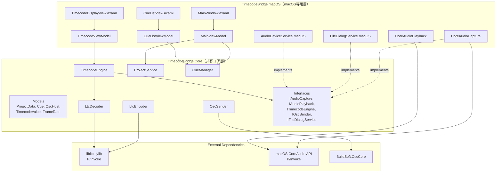
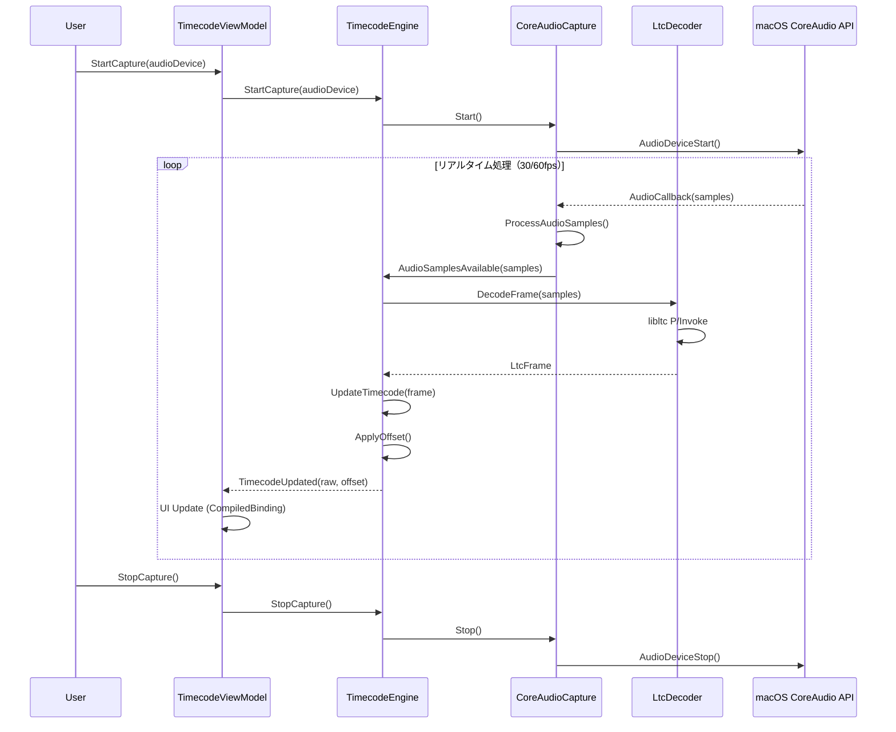
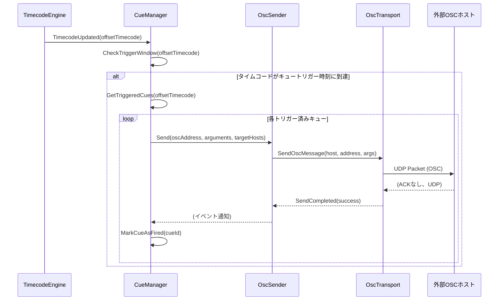
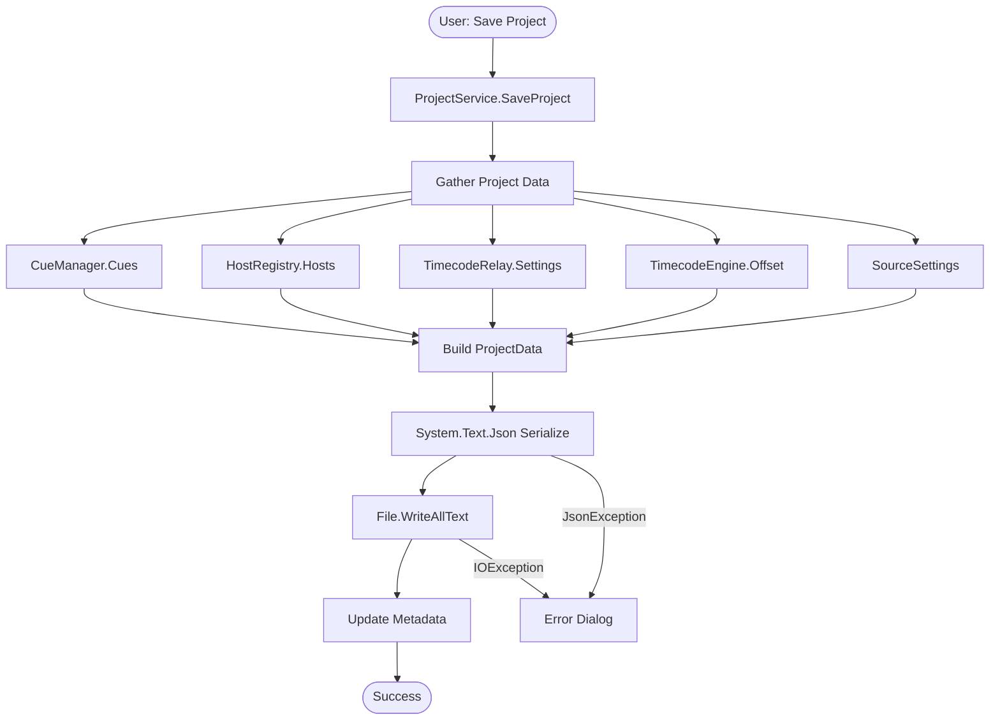
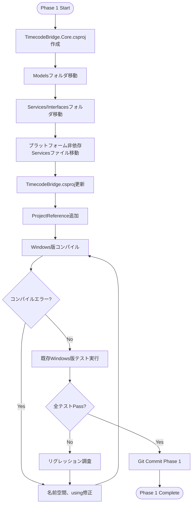

# Technical Design Document: mac-app

## Overview

**Purpose**: 既存のWindows専用TimecodeBridgeアプリケーションをmacOS環境でネイティブに動作させるため、Avalonia UIとCoreAudioを使用したクロスプラットフォーム対応アプリケーションを開発する。本設計により、LTC（Linear Timecode）のエンコード/デコード、OSC送信、キュー管理機能をmacOSユーザーに提供し、Windows版と同等の機能性とパフォーマンスを実現する。

**Users**: 映像・音響制作現場のエンジニア、ライブイベント技術者が、macOS環境でタイムコード同期システムを構築するために利用する。既存のWindows版ユーザーがmacOS環境に移行する場合も、プロジェクトファイルの互換性により作業の連続性を保証する。

**Impact**: 現在のWindows専用アーキテクチャから、プラットフォーム非依存のコアロジックとプラットフォーム固有実装を分離したLayered Architecture + Adapter Patternに移行する。これにより、既存のWindows版を保持しつつ、macOS版を並行開発・保守する体制を確立する。

### Goals
- 既存Windows版の全機能をmacOSで再現（LTCエンコード/デコード、タイムコード生成/リレー、OSC送信、キュー管理、プロジェクト管理）
- Windows版プロジェクトファイル（JSON）との完全な互換性維持
- macOS 12 (Monterey)以降、x64/ARM64（Apple Silicon）両アーキテクチャ対応
- 1フレーム以内のレイテンシ（<33ms @ 30fps）、CPU使用率10%以下の高性能動作
- macOS Human Interface Guidelines（HIG）準拠のネイティブUI実装
- コード署名・公証による配布可能な.appバンドル作成

### Non-Goals
- Windows版の機能追加・変更（macOS版はWindows版のポーティングに専念）
- LinuxまたはiOS/Android対応（Avalonia UIは対応可能だが、本フェーズではmacOSのみ）
- Windows版との統合プロジェクト（条件コンパイルによる単一コードベース）は保守性の観点から除外
- リアルタイムビデオ同期機能（タイムコードのみ、映像処理は含まない）

---

## Architecture

### Existing Architecture Analysis

既存のWindows版TimecodeBridgeは優れたMVVMアーキテクチャを採用しており、以下の特性を持つ:

**アーキテクチャパターン**:
- **MVVM（Model-View-ViewModel）**: WPF標準パターン、CommunityToolkit.Mvvm使用
- **DI Container**: Microsoft.Extensions.DependencyInjectionによるサービスライフタイム管理
- **Interfaceベース設計**: 全サービスがインターフェースを持ち、テスタビリティが高い
- **イベント駆動**: `TimecodeEngine.TimecodeUpdated`イベントを中心とした疎結合設計
- **非同期処理**: `Channel<T>`ベースのタイムコード処理、`async/await`パターン徹底

**ドメイン境界**:
- **Models**: データ構造のみ、ビジネスロジックなし（ProjectData、Cue、OscHost、TimecodeValue等）
- **Services**: ビジネスロジック実装、Interfaceによる依存性逆転
- **ViewModels**: プレゼンテーションロジック、View-Service間の仲介
- **Views**: WPF XAML、純粋な表示ロジックのみ

**技術的負債と制約**:
- **NAudio Windows依存**: `NAudio.CoreAudioApi`（Windows WASAPI）への密結合
- **WPF Dispatcher**: ViewModel内に`Application.Current.Dispatcher`呼び出しが散在
- **ファイルダイアログ**: `OpenFileDialog`/`SaveFileDialog`（WPF標準）への直接依存

**再利用可能コンポーネント（gap-analysis結論）**:
- **高再利用性（90-100%）**: Models全体、ProjectService、OscSender、CueManager、TimecodeGenerator、LtcEncoder/Decoder
- **中再利用性（50-80%）**: ViewModels（Dispatcher変更必要）、TimecodeEngine（オーディオAPI抽象化必要）
- **低再利用性（0-20%）**: Views（Avalonia XAML移植）、AudioDeviceService（CoreAudio実装）

### Architecture Pattern & Boundary Map

**選定パターン**: **Layered Architecture + MVVM + Adapter Pattern（ハイブリッド）**



**Architecture Integration**:
- **選定パターン**: Layered Architecture（3層: Core、Platform Services、UI）+ Port & Adapter（オーディオI/O、ファイルダイアログ）
- **ドメイン境界**:
  - `TimecodeBridge.Core`: プラットフォーム非依存ビジネスロジック、データモデル、インターフェース定義
  - `TimecodeBridge.macOS`: macOS固有実装（Avalonia UI、CoreAudio、macOSファイルダイアログ）
  - `TimecodeBridge（Windows版）`: Windows固有実装（WPF UI、NAudio WASAPI） ※既存
- **新規コンポーネント理由**:
  - `CoreAudioCapture`/`CoreAudioPlayback`: NAudio非対応のため、CoreAudio P/Invokeによるアダプタ実装必須
  - `FileDialogService.macOS`: Avaloniaのファイルダイアログラッパー、macOS標準ダイアログ体験提供
  - `AudioDeviceService.macOS`: CoreAudioデバイス列挙、Windows版の`MMDeviceEnumerator`相当
- **Steering準拠**: 既存のMVVMパターン踏襲、DI Container継続使用、Interface-First設計維持

### Technology Stack

| Layer | Choice / Version | Role in Feature | Notes |
|-------|------------------|-----------------|-------|
| **Frontend / UI** | Avalonia UI 11.3+ | macOSネイティブUI、XAML-based MVVM | WPF類似XAML、Metal APIレンダリング、60fps対応実証済み |
| **Backend / Services** | .NET 8.0 | クロスプラットフォームランタイム | macOS 12+、x64/ARM64対応、JIT entitlement必須 |
| | CommunityToolkit.Mvvm 8.4.0 | MVVM基盤（既存） | RelayCommand、ObservableObject、既存ViewModelと互換 |
| | BuildSoft.OscCore 1.2.1.1 | OSC通信（既存） | クロスプラットフォーム、Windows版と共通 |
| **Audio / LTC** | macOS CoreAudio P/Invoke | オーディオ入出力 | ネイティブAPI、低レイテンシ、IAudioCapture/IAudioPlayback実装 |
| | libltc.dylib (Universal Binary) | LTCエンコード/デコード | x64/ARM64ユニバーサルバイナリ、P/Invoke呼び出し |
| **Data / Storage** | System.Text.Json | プロジェクトファイル永続化 | JSON形式、Windows版と互換性維持 |
| **Infrastructure / Runtime** | .app Bundle + Notarization | macOS配布形態 | コード署名、公証（xcrun notarytool）、Gatekeeper対応 |

**Technology Decisions（research.mdより）**:
- **Avalonia UI選定理由**: WPF XAML類似性（移植コスト削減）、60fps@1080p実証済み、Metal API高性能レンダリング、クロスプラットフォーム（将来Linux対応可能）
- **CoreAudio P/Invoke選定理由**: NAudio macOS非対応（2025年時点）、ネイティブAPI完全制御、IAudioCapture抽象化で影響局所化
- **libltc.dylib選定理由**: 既存Windows版と同一ライブラリ（APIレベル互換）、Homebrewまたはソースビルド、CFLAGS方式でユニバーサルバイナリ構築

---

## System Flows

### Flow 1: Audio Capture → LTC Decode → Timecode Update



**Key Decisions**:
- CoreAudioコールバックは専用スレッドで実行、`Channel<T>`経由でTimecodeEngineワーカースレッドに転送
- LtcDecoderは同期処理（P/Invoke呼び出し）だが、デコード処理自体は軽量（<1ms）
- TimecodeUpdatedイベントはAvalonia Dispatcher.UIThreadにマーシャリング、CompiledBindingsで高速UI更新

### Flow 2: Cue Trigger → OSC Send



**Key Decisions**:
- CueManagerは高水準マーク（HighWaterMark）方式でジッター耐性を確保（gap-analysis既存実装）
- OSC送信は非同期だが、FireAndForget方式（UDP特性）
- 送信失敗はログに記録するが、タイムコード処理は継続（リアルタイム性優先）

### Flow 3: Project Save → JSON Serialization



**Key Decisions**:
- ProjectDataは既存Windows版と同一スキーマ（互換性維持）
- OscArgumentの多態性はJsonConverter（OscArgumentJsonConverter）で処理
- 保存失敗時はユーザーにエラーダイアログ表示、データはメモリ上に保持

---

## Requirements Traceability

| Requirement | Summary | Components | Interfaces | Flows |
|-------------|---------|------------|------------|-------|
| 1.1 | .NET 8.0クロスプラットフォーム対応 | TimecodeBridge.Core.csproj, TimecodeBridge.macOS.csproj | - | - |
| 1.2 | macOS 12+サポート | TimecodeBridge.macOS.csproj (TargetFramework) | - | - |
| 1.3 | x64/ARM64両対応 | dotnet publish (-r osx-x64, -r osx-arm64) | - | - |
| 1.4 | 実行環境検出とネイティブリソース読込 | App.axaml.cs, libltc.dylib bundling | - | - |
| 2.1 | Avalonia UI使用 | MainWindow.axaml, TimecodeDisplayView.axaml, CueListView.axaml | - | - |
| 2.2 | macOS HIG準拠 | Avalonia Themes, macOS標準コントロール | - | - |
| 2.3 | レスポンシブレイアウト | Avalonia Layout System | - | - |
| 2.4 | ダーク/ライトモード | Avalonia FluentTheme, macOSシステム設定連動 | - | - |
| 2.5 | macOS標準メニューバー | NativeMenu (Avalonia) | - | - |
| 3.1 | CoreAudioによるデバイスアクセス | AudioDeviceService.macOS, CoreAudioCapture | IAudioCapture, IAudioDeviceService | Flow 1 |
| 3.2 | デバイスリストアップ | AudioDeviceService.macOS.GetCaptureDevices() | IAudioDeviceService | - |
| 3.3 | デバイス接続確立 | CoreAudioCapture.Start() | IAudioCapture | Flow 1 |
| 3.4 | リアルタイムストリーム処理 | CoreAudioCapture.AudioCallback | IAudioCapture | Flow 1 |
| 3.5 | デバイス切断エラー処理 | TimecodeEngine, ErrorHandling | ITimecodeEngine | - |
| 4.1 | libltc.dylib使用 | LtcEncoder, LtcDecoder, Native/LtcFrameHelper | - | Flow 1 |
| 4.2 | LTCエンコード（全フレームレート） | LtcEncoder.EncodeFrame() | ILtcEncoder | - |
| 4.3 | LTCデコード | LtcDecoder.DecodeFrame() | ILtcDecoder | Flow 1 |
| 4.4 | Windows版と同一LTCフレーム構造 | Native/LtcFrameHelper (共有) | - | - |
| 4.5 | 受信ステータス視覚表示 | TimecodeViewModel.IsReceiving | - | Flow 1 |
| 5.1 | 内部生成モード | TimecodeGenerator, GeneratorController | ITimecodeGenerator | - |
| 5.2 | リレーモード | TimecodeRelay, LtcCaptureController | ITimecodeRelay | Flow 1 |
| 5.3 | オフセット適用 | TimecodeEngine.Offset | ITimecodeEngine | Flow 1 |
| 5.4 | 開始/停止/リセット操作 | TimecodeViewModel Commands | - | - |
| 5.5 | リアルタイムタイムコード表示 | TimecodeViewModel, CompiledBindings | - | Flow 1 |
| 6.1 | BuildSoft.OscCore使用 | OscSender, OscTransport | IOscSender, IOscTransport | Flow 2 |
| 6.2 | OSCホスト設定 | HostRegistry, HostManagerViewModel | IHostRegistry | - |
| 6.3 | タイムコード更新時OSC送信 | TimecodeRelay.OnTimecodeUpdated | ITimecodeRelay | Flow 2 |
| 6.4 | OSC引数型サポート | OscArgument (Int32, Float32, String, MidiTimecode) | - | Flow 2 |
| 6.5 | OSC送信失敗ログ記録 | OscSender.SendCompleted, LogViewModel | - | Flow 2 |
| 7.1 | キュー作成 | CueManager.AddCue(), CueDialogService | ICueManager, ICueDialogService | - |
| 7.2 | トリガー時刻到達時OSC送信 | CueManager.OnTimecodeUpdated | ICueManager | Flow 2 |
| 7.3 | 次キューハイライト表示 | CueListViewModel.NextCue | - | - |
| 7.4 | キューミュート | Cue.IsMuted, CueManager | ICueManager | - |
| 7.5 | 一括編集/複製/削除 | CueBatchEditDialog, CueManager | ICueManager | - |
| 8.1 | JSON形式保存 | ProjectService.SaveProject(), ProjectData | IProjectService | Flow 3 |
| 8.2 | JSON形式読込 | ProjectService.LoadProject() | IProjectService | - |
| 8.3 | 最近使用プロジェクト | RecentProjectsService | IRecentProjectsService | - |
| 8.4 | 読込失敗エラーダイアログ | MainViewModel.OpenProject (exception handling) | - | - |
| 8.5 | Windows版互換性 | ProjectData.CreateJsonOptions() (共有) | - | Flow 3 |
| 9.1 | NSOpenPanel（Avaloniaラッパー） | FileDialogService.macOS.ShowOpenDialog | IFileDialogService | - |
| 9.2 | NSSavePanel（Avaloniaラッパー） | FileDialogService.macOS.ShowSaveDialog | IFileDialogService | - |
| 9.3 | 標準キーボードショートカット | NativeMenu KeyGestures (Cmd+O, Cmd+S, Cmd+Q) | - | - |
| 9.4 | バックグラウンド動作継続 | TimecodeEngine (UIスレッド非依存) | - | - |
| 9.5 | 未保存変更確認ダイアログ | MainWindow.Closing, ProjectService.HasUnsavedChanges | IProjectService | - |
| 10.1 | タイムスタンプ付きログ記録 | LogViewModel.AddLog() | - | - |
| 10.2 | ログレベル視覚区別 | LogEntry.Level, LogView XAML (色分け) | - | - |
| 10.3 | ログクリア | LogViewModel.ClearCommand | - | - |
| 10.4 | ログエクスポート | LogViewModel.ExportCommand | - | - |
| 10.5 | 最大1000件保持 | LogViewModel (CircularBuffer) | - | - |
| 11.1 | libltc.dylibバンドル | TimecodeBridge.macOS.csproj (Content Include) | - | - |
| 11.2 | アーキテクチャ別.dylib選択 | dotnet publish RID (-r osx-x64 / osx-arm64) | - | - |
| 11.3 | P/Invoke動的リンク | LtcEncoder/Decoder DllImport(@rpath/libltc.dylib) | - | - |
| 11.4 | .dylib不在時エラー表示 | App.axaml.cs OnStartup (DllNotFoundException) | - | - |
| 12.1 | .appバンドルパッケージ化 | dotnet publish --self-contained | - | - |
| 12.2 | Info.plist設定 | Info.plist (CFBundleIdentifier, NSMicrophoneUsageDescription) | - | - |
| 12.3 | Applicationsフォルダインストール | DMG配布形態 | - | - |
| 12.4 | コード署名・公証 | codesign, xcrun notarytool | - | - |
| 12.5 | DMG視覚的インストール手順 | DMGテンプレート、ドラッグ&ドロップUI | - | - |
| 13.1 | 1フレーム以内レイテンシ | CoreAudioCapture (低バッファサイズ), Channel<T> | IAudioCapture | Flow 1 |
| 13.2 | 24時間連続動作 | TimecodeEngine Dispose pattern, メモリ管理 | - | - |
| 13.3 | UI応答性維持 | Avalonia Dispatcher.UIThread, CompiledBindings | - | Flow 1 |
| 13.4 | CPU使用率10%以下 | 非同期処理、Channel<T>、効率的レンダリング | - | - |
| 13.5 | 1000件キューパフォーマンス | CueManager (LINQ最適化), DataGrid仮想化 | ICueManager | - |

---

## Components and Interfaces

### Component Summary

| Component | Domain/Layer | Intent | Req Coverage | Key Dependencies (P0/P1) | Contracts |
|-----------|--------------|--------|--------------|--------------------------|-----------|
| **ProjectData** | Core/Models | プロジェクト永続化データ構造 | 8.1, 8.2, 8.5 | System.Text.Json (P0) | State |
| **TimecodeEngine** | Core/Services | タイムコード処理中核エンジン | 5.1-5.5, 13.1, 13.2 | IAudioCapture (P0), ILtcDecoder (P0) | Service, Event |
| **CoreAudioCapture** | macOS/Services | CoreAudio P/Invokeキャプチャ実装 | 3.1, 3.3, 3.4, 13.1 | macOS CoreAudio API (P0) | Service |
| **LtcDecoder** | Core/Services | LTCデコードP/Invokeラッパー | 4.1, 4.3, 4.4 | libltc.dylib (P0) | Service |
| **CueManager** | Core/Services | キュートリガー管理 | 7.1-7.5, 13.5 | ITimecodeEngine (P0), IOscSender (P0) | Service, Event |
| **OscSender** | Core/Services | OSCメッセージ送信 | 6.1, 6.3-6.5 | BuildSoft.OscCore (P0) | Service |
| **MainViewModel** | macOS/ViewModels | メインウィンドウViewModel | 8.1-8.4, 9.5 | IProjectService (P0), ICueManager (P0) | State |
| **TimecodeViewModel** | macOS/ViewModels | タイムコード表示ViewModel | 5.4, 5.5, 13.3 | ITimecodeEngine (P0) | State |
| **MainWindow.axaml** | macOS/Views | メインウィンドウAvalonia UI | 2.1-2.5, 9.1-9.3 | MainViewModel (P0) | - |
| **FileDialogService.macOS** | macOS/Services | Avaloniaファイルダイアログラッパー | 9.1, 9.2 | Avalonia.Controls.StorageProvider (P0) | Service |

### Core Layer (TimecodeBridge.Core)

#### TimecodeEngine

| Field | Detail |
|-------|--------|
| Intent | タイムコード生成、LTCキャプチャ、オフセット適用を統括するコアエンジン |
| Requirements | 5.1, 5.2, 5.3, 5.5, 13.1, 13.2, 13.4 |

**Responsibilities & Constraints**:
- タイムコード値の一元管理（Raw、Offset適用後）
- LTCキャプチャまたは内部生成モードの切替
- `Channel<T>`による非同期タイムコード処理（UIスレッド非依存）
- フレームレート動的切替対応
- Freerunタイマー管理（信号欠落時の自動継続）

**Dependencies**:
- Inbound: TimecodeViewModel → CurrentOffsetTimecode購読 (P0)
- Inbound: CueManager → TimecodeUpdatedイベント購読 (P0)
- Outbound: IAudioCapture → オーディオキャプチャ開始/停止 (P0)
- Outbound: ILtcDecoder → LTCフレームデコード (P0)
- Outbound: ITimecodeGenerator → 内部生成モード (P1)

**Contracts**: Service [x] / Event [x] / State [x]

##### Service Interface
```csharp
public interface ITimecodeEngine : IDisposable
{
    // Properties
    TimecodeValue CurrentRawTimecode { get; }
    TimecodeValue CurrentOffsetTimecode { get; }
    TimecodeOffset Offset { get; set; }
    FrameRate FrameRate { get; set; }
    TimecodeSourceType ActiveSource { get; }
    bool IsReceiving { get; }
    double FreerunDurationSeconds { get; set; }
    bool IsFreerunning { get; }

    // Methods
    void StartCapture(AudioDeviceInfo audioDevice);
    void StopCapture();
    void StartGenerator(TimecodeValue startTimecode);
    void StopGenerator();
    void Stop();

    // Events
    event EventHandler<TimecodeUpdatedEventArgs> TimecodeUpdated;
    event EventHandler<TimecodeStatusChangedEventArgs> StatusChanged;
    event EventHandler<AudioSamplesEventArgs> AudioSamplesAvailable;
}
```

**Preconditions**:
- `StartCapture`: audioDeviceが有効なデバイスID、CoreAudio権限付与済み
- `StartGenerator`: startTimecodeが指定FrameRateで有効な値

**Postconditions**:
- `StartCapture`: IsReceiving=true、TimecodeUpdatedイベント発火開始（30/60fps）
- `Stop`: 全リソース解放、イベント停止

**Invariants**:
- CurrentRawTimecode、CurrentOffsetTimecodeはスレッドセーフ（lock保護）
- TimecodeUpdatedイベントはChannelワーカースレッドから発火、UIスレッド非保証

##### Event Contract
**Published Events**:
- `TimecodeUpdated(TimecodeValue rawTimecode, TimecodeValue offsetTimecode)`: 毎フレーム発火（30/60fps）
- `StatusChanged(bool isReceiving, TimecodeSourceType source)`: ソース切替時、信号欠落時
- `AudioSamplesAvailable(byte[] samples, int sampleRate)`: オーディオ波形表示用（オプション）

**Ordering / Delivery Guarantees**:
- TimecodeUpdatedは順序保証（Channel<T>FIFO）
- UIスレッドへのマーシャリングはViewModel責務（Avalonia Dispatcher.UIThread使用）

**Implementation Notes**:
- **Integration**: CoreAudioCaptureからのコールバックをChannelに投入、専用ワーカースレッドで処理
- **Validation**: FrameRate変更時、既存Offset値の再計算（InvalidOperationException回避）
- **Risks**: 信号欠落時のFreerunタイマー精度（±1フレーム誤差許容）、長時間動作時のメモリリーク（Dispose徹底）

---

#### CueManager

| Field | Detail |
|-------|--------|
| Intent | キューリスト管理、タイムコード到達時のOSCトリガー発火 |
| Requirements | 7.1, 7.2, 7.3, 7.4, 7.5, 13.5 |

**Responsibilities & Constraints**:
- キューの追加/更新/削除/並替
- 高水準マーク（HighWaterMark）方式によるトリガー判定（ジッター耐性）
- ミュート機能（個別キュー無効化）
- トリガーウィンドウ設定（デフォルト3フレーム）

**Dependencies**:
- Inbound: CueListViewModel → Cuesプロパティバインディング (P0)
- Outbound: ITimecodeEngine → TimecodeUpdatedイベント購読 (P0)
- Outbound: IOscSender → OSCメッセージ送信 (P0)

**Contracts**: Service [x] / Event [x]

##### Service Interface
```csharp
public interface ICueManager
{
    IReadOnlyList<Cue> Cues { get; }
    int TriggerWindowFrames { get; set; }
    bool IsMuted { get; set; }

    void AddCue(Cue cue);
    void UpdateCue(string cueId, Cue updatedCue);
    void RemoveCue(string cueId);
    void ReorderCues(IReadOnlyList<string> orderedCueIds);
    void ClearAllCues();
    void ResetFiredCues();
}
```

**Preconditions**:
- `AddCue`: cue.Idが一意、cue.TriggerTimecodeが有効な値
- `UpdateCue`: cueIdが既存キューに存在

**Postconditions**:
- `AddCue`: Cuesリストに追加、CueListViewModelに通知
- トリガー発火後、該当キューは発火済みマーク（ResetFiredCuesで解除）

**Invariants**:
- Cuesの順序はユーザー指定順（トリガー時刻昇順でない可能性あり）
- HighWaterMarkは単調増加（タイムコード逆行時はリセット）

**Implementation Notes**:
- **Integration**: OnTimecodeUpdated内でHighWaterMark比較、トリガーウィンドウ内のキューを抽出
- **Validation**: 1000件キュー登録時のパフォーマンステスト必須（LINQ最適化、Binary Search検討）
- **Risks**: タイムコード逆行（巻き戻し）時の誤トリガー防止（HighWaterMarkリセット処理）

---

#### ProjectService

| Field | Detail |
|-------|--------|
| Intent | プロジェクトファイル（JSON）の読み書き、変更状態管理 |
| Requirements | 8.1, 8.2, 8.4, 8.5 |

**Responsibilities & Constraints**:
- ProjectDataのJSON永続化（System.Text.Json使用）
- Windows版との互換性維持（スキーマ共有）
- 未保存変更フラグ管理
- ファイルI/O例外処理

**Dependencies**:
- Inbound: MainViewModel → LoadProject/SaveProject呼び出し (P0)
- Outbound: System.Text.Json → SerializeとDeserialize (P0)
- Outbound: System.IO.File → ReadAllText/WriteAllText (P0)

**Contracts**: Service [x] / Event [x]

##### Service Interface
```csharp
public interface IProjectService
{
    string? CurrentFilePath { get; }
    bool HasUnsavedChanges { get; }

    ProjectData LoadProject(string filePath);
    void SaveProject(string filePath, ProjectData data);
    void MarkAsChanged();

    event EventHandler<EventArgs> UnsavedChangesStatusChanged;
}
```

**Preconditions**:
- `LoadProject`: filePathが存在するファイル、JSON形式が有効
- `SaveProject`: dataが有効なProjectDataインスタンス

**Postconditions**:
- `LoadProject`: CurrentFilePathが設定され、HasUnsavedChanges=false
- `SaveProject`: ファイル書き込み成功、HasUnsavedChanges=false

**Invariants**:
- CurrentFilePathはnull（新規プロジェクト）または有効なパス
- HasUnsavedChangesは変更検出時のみtrue

**Implementation Notes**:
- **Integration**: MainViewModelのNewProject/OpenProject/SaveProjectコマンドから呼び出し
- **Validation**: JSON Deserialize失敗時はInvalidOperationExceptionスロー（MainViewModelでcatch）
- **Risks**: 大規模プロジェクト（キュー数千件）での保存遅延（非同期化検討）

---

### macOS Services Layer

#### CoreAudioCapture

| Field | Detail |
|-------|--------|
| Intent | macOS CoreAudio APIを使用したオーディオキャプチャ実装 |
| Requirements | 3.1, 3.3, 3.4, 13.1 |

**Responsibilities & Constraints**:
- CoreAudio Audio Unitによる低レイテンシキャプチャ
- リアルタイムコールバック処理（専用スレッド）
- サンプルレート変換（48kHz → 48kHz固定、LTC互換）
- デバイス切断検出とエラーハンドリング

**Dependencies**:
- Inbound: TimecodeEngine → Start/Stop呼び出し (P0)
- Outbound: macOS CoreAudio Framework → P/Invoke (AudioUnit, AudioComponent) (P0)
- External: macOS TCC権限 → NSMicrophoneUsageDescription必須 (P0)

**Contracts**: Service [x] / Event [x]

##### Service Interface
```csharp
public interface IAudioCapture : IDisposable
{
    void Start(AudioDeviceInfo device);
    void Stop();

    event EventHandler<AudioSamplesEventArgs> AudioSamplesAvailable;
    event EventHandler<AudioErrorEventArgs> ErrorOccurred;
}
```

**Preconditions**:
- `Start`: deviceが有効なCoreAudioデバイスID、TCC権限付与済み
- CoreAudio Frameworkがシステムに存在（macOS 10.5+保証）

**Postconditions**:
- `Start`: AudioSamplesAvailableイベント発火開始（48kHz、16bit PCM）
- `Stop`: Audio Unit停止、リソース解放

**Invariants**:
- AudioSamplesAvailableはリアルタイムスレッドから発火（UIスレッド非保証）
- サンプルバッファは48kHzモノラル16bit固定

##### P/Invoke Signatures (CoreAudio)
```csharp
[DllImport("/System/Library/Frameworks/CoreAudio.framework/CoreAudio")]
private static extern int AudioComponentFindNext(IntPtr inComponent, ref AudioComponentDescription inDesc);

[DllImport("/System/Library/Frameworks/CoreAudio.framework/CoreAudio")]
private static extern int AudioComponentInstanceNew(IntPtr inComponent, out IntPtr outInstance);

[DllImport("/System/Library/Frameworks/CoreAudio.framework/CoreAudio")]
private static extern int AudioUnitSetProperty(IntPtr inUnit, uint inID, uint inScope, uint inElement, IntPtr inData, uint inDataSize);

[DllImport("/System/Library/Frameworks/CoreAudio.framework/CoreAudio")]
private static extern int AudioOutputUnitStart(IntPtr ci);

[DllImport("/System/Library/Frameworks/CoreAudio.framework/CoreAudio")]
private static extern int AudioOutputUnitStop(IntPtr ci);

// AudioUnitRenderCallback delegate
private delegate int AudioUnitRenderCallbackDelegate(
    IntPtr inRefCon,
    ref AudioUnitRenderActionFlags ioActionFlags,
    ref AudioTimeStamp inTimeStamp,
    uint inBusNumber,
    uint inNumberFrames,
    IntPtr ioData);
```

**Implementation Notes**:
- **Integration**: AudioCapサンプルコード（GitHub - insidegui/AudioCap）を参考にP/Invokeラッパー実装
- **Validation**: TCC権限未付与時はAudioUnitSetProperty失敗（-50エラー）、適切なエラーメッセージ表示
- **Risks**: CoreAudio APIドキュメント不足、トラブルシューティング困難。Phase 2技術検証で早期リスク解消

---

#### FileDialogService.macOS

| Field | Detail |
|-------|--------|
| Intent | Avaloniaファイルダイアログラッパー（macOS標準ダイアログ体験提供） |
| Requirements | 9.1, 9.2 |

**Responsibilities & Constraints**:
- Avalonia StorageProviderを使用したファイル選択ダイアログ表示
- macOS標準NSOpenPanel/NSSavePanelのルック&フィール
- ファイルフィルタ設定（.jsonプロジェクトファイル）

**Dependencies**:
- Inbound: MainViewModel → ShowOpenDialog/ShowSaveDialog呼び出し (P0)
- Outbound: Avalonia.Platform.Storage.IStorageProvider (P0)

**Contracts**: Service [x]

##### Service Interface
```csharp
public interface IFileDialogService
{
    Task<string?> ShowOpenDialogAsync(string title, string filter);
    Task<string?> ShowSaveDialogAsync(string title, string defaultFileName, string filter);
}
```

**Preconditions**:
- Avaloniaウィンドウが初期化済み（StorageProvider取得可能）

**Postconditions**:
- ユーザーがキャンセルした場合はnull返却、選択時は絶対パス返却

**Invariants**:
- 非同期処理（async/await）、UIスレッドブロックなし

**Implementation Notes**:
- **Integration**: MainViewModelのOpenMenuItem_Click/SaveAsMenuItem_Clickから呼び出し
- **Validation**: Avalonia 11.3+のStorageProvider APIを使用（従来のOpenFileDialog非推奨）
- **Risks**: Avaloniaバージョンアップ時のAPI変更（Breaking Changes対応）

---

### ViewModels Layer (macOS)

#### MainViewModel

| Field | Detail |
|-------|--------|
| Intent | メインウィンドウのプレゼンテーションロジック、プロジェクト管理コマンド |
| Requirements | 8.1, 8.2, 8.3, 8.4, 9.5 |

**Responsibilities & Constraints**:
- プロジェクトファイルの新規作成/開く/保存コマンド
- 未保存変更検出と確認ダイアログ表示
- 最近使用プロジェクトリスト管理
- 子ViewModels（TimecodeVM、CueListVM）のライフサイクル管理

**Dependencies**:
- Inbound: MainWindow.axaml → DataContext (P0)
- Outbound: IProjectService → LoadProject/SaveProject (P0)
- Outbound: IFileDialogService → ダイアログ表示 (P0)
- Outbound: IRecentProjectsService → 最近使用プロジェクト (P1)
- Outbound: TimecodeViewModel, CueListViewModel (P0)

**Contracts**: State [x]

##### State Management
**State Model**:
```csharp
public partial class MainViewModel : ObservableObject
{
    [ObservableProperty]
    private string _title = "TimecodeBridge";

    [ObservableProperty]
    private bool _hasUnsavedChanges;

    [ObservableProperty]
    private IReadOnlyList<string> _recentProjects = [];

    // Child ViewModels
    public TimecodeViewModel TimecodeViewModel { get; }
    public CueListViewModel CueListViewModel { get; }
    public RelayViewModel RelayViewModel { get; }
}
```

**Persistence**: ProjectServiceによるJSON永続化（FlowRef: Flow 3）

**Concurrency Strategy**: Avalonia UIスレッド単一、コマンド実行中は非同期化（async RelayCommand）

**Implementation Notes**:
- **Integration**: CommunityToolkit.Mvvm Source Generatorによるコマンド自動生成（`[RelayCommand]`属性）
- **Validation**: ウィンドウClosingイベントでHasUnsavedChanges確認、キャンセル可能
- **Risks**: 子ViewModelのDispose忘れによるメモリリーク（IDisposable実装徹底）

---

#### TimecodeViewModel

| Field | Detail |
|-------|--------|
| Intent | タイムコード表示、オーディオデバイス選択、開始/停止コマンド |
| Requirements | 5.4, 5.5, 13.3 |

**Responsibilities & Constraints**:
- TimecodeEngineのCurrentOffsetTimecodeをUI表示形式に変換
- オーディオデバイスリスト管理
- StartCapture/StopCaptureコマンド実装
- 60fps UI更新対応（CompiledBindings使用）

**Dependencies**:
- Inbound: TimecodeDisplayView.axaml → DataContext (P0)
- Outbound: ITimecodeEngine → TimecodeUpdatedイベント購読 (P0)
- Outbound: IAudioDeviceService → デバイスリスト取得 (P0)

**Contracts**: State [x]

##### State Management
**State Model**:
```csharp
public partial class TimecodeViewModel : DispatcherViewModel
{
    [ObservableProperty]
    private string _currentTimecodeDisplay = "00:00:00:00";

    [ObservableProperty]
    private bool _isReceiving;

    [ObservableProperty]
    private AudioDeviceInfo? _selectedAudioDevice;

    [ObservableProperty]
    private IReadOnlyList<AudioDeviceInfo> _audioDevices = [];
}
```

**Persistence**: なし（揮発性状態）

**Concurrency Strategy**: TimecodeUpdatedイベントをDispatcher.UIThreadにマーシャリング

**Implementation Notes**:
- **Integration**: `DispatcherViewModel`基底クラスで`RunOnUIThread(Action)`ヘルパー提供
- **Validation**: CompiledBindings使用（`{CompiledBinding CurrentTimecodeDisplay}`）、リフレクションオーバーヘッド削減
- **Risks**: 60fps更新時のUI描画負荷、Avalonia TextBlock更新パフォーマンス検証必須（Phase 2）

---

### Views Layer (macOS)

#### MainWindow.axaml

| Field | Detail |
|-------|--------|
| Intent | アプリケーションメインウィンドウ、メニューバー、子View配置 |
| Requirements | 2.1, 2.2, 2.3, 2.4, 2.5, 9.3 |

**Implementation Notes**:
- **Avalonia XAML構造**:
```xml
<Window xmlns="https://github.com/avaloniaui"
        xmlns:x="http://schemas.microsoft.com/winfx/2006/xaml"
        xmlns:vm="using:TimecodeBridge.ViewModels"
        x:Class="TimecodeBridge.macOS.Views.MainWindow"
        Title="{CompiledBinding Title}"
        Width="1200" Height="800"
        x:DataType="vm:MainViewModel">

    <NativeMenu.Menu>
        <NativeMenu>
            <NativeMenuItem Header="File">
                <NativeMenu>
                    <NativeMenuItem Header="New Project" Command="{CompiledBinding NewProjectCommand}" HotKey="Cmd+N"/>
                    <NativeMenuItem Header="Open..." Command="{CompiledBinding OpenProjectCommand}" HotKey="Cmd+O"/>
                    <NativeMenuItem Header="Save" Command="{CompiledBinding SaveProjectCommand}" HotKey="Cmd+S"/>
                </NativeMenu>
            </NativeMenuItem>
        </NativeMenu>
    </NativeMenu.Menu>

    <Grid RowDefinitions="Auto,*,Auto">
        <!-- Timecode Display -->
        <views:TimecodeDisplayView Grid.Row="0" DataContext="{CompiledBinding TimecodeViewModel}"/>

        <!-- Cue List -->
        <views:CueListView Grid.Row="1" DataContext="{CompiledBinding CueListViewModel}"/>

        <!-- Status Bar -->
        <TextBlock Grid.Row="2" Text="{CompiledBinding StatusMessage}"/>
    </Grid>
</Window>
```

- **Integration**: WPF MainWindow.xamlから移植、NativeMenu使用でmacOS標準メニューバー実装
- **Validation**: ダーク/ライトモード対応はFluentTheme自動適用（App.axaml設定）
- **Risks**: WPF→Avalonia XAML移植時の構文差異（ElementName → #elementName、RelativeSource → $parent変換必須）

---

## Data Models

### Domain Model

**Aggregates and Transactional Boundaries**:
- **ProjectData (Aggregate Root)**: プロジェクト全体の状態を保持、単一トランザクション境界
  - Entities: `List<Cue>`, `List<OscHost>`
  - Value Objects: `TimecodeOffset`, `TimecodeSourceSettings`, `RelaySettings`

**Entities**:
- **Cue**: キュー（ID、名前、トリガー時刻、OSCアドレス、引数、ミュート状態）
- **OscHost**: OSCホスト（ID、名前、IPアドレス、ポート、有効/無効）

**Value Objects**:
- **TimecodeValue**: タイムコード値（時、分、秒、フレーム、フレームレート）、イミュータブル
- **TimecodeOffset**: オフセット値（符号、時、分、秒、フレーム）、イミュータブル
- **FrameRate**: フレームレート列挙型（23.98、24、25、29.97、30、59.94、60fps）

**Domain Events**:
- `TimecodeUpdated`: タイムコード更新時（毎フレーム）
- `CueTriggered`: キュートリガー発火時
- `OscSendCompleted`: OSC送信完了時（成功/失敗）

**Business Rules & Invariants**:
- TimecodeValueは指定FrameRateで有効な値のみ許可（例: 30fpsでフレーム=29まで）
- Cue.TriggerTimecodeは00:00:00:00以上の正値
- OscHost.Portは1-65535の範囲
- ProjectData内のCue.Id、OscHost.Idは一意

### Logical Data Model

**Structure Definition**:
```
ProjectData (JSON Root)
├── Cues: List<Cue>
│   ├── Id: string (GUID)
│   ├── Name: string
│   ├── TriggerTimecode: TimecodeValue
│   ├── OscAddress: string (e.g., "/cue/trigger")
│   ├── Arguments: List<OscArgument>
│   └── IsMuted: bool
├── Hosts: List<OscHost>
│   ├── Id: string (GUID)
│   ├── Name: string
│   ├── IpAddress: string (IPv4)
│   ├── Port: int
│   └── IsEnabled: bool
├── RelaySettings: RelaySettings
│   ├── OscAddressPattern: string
│   ├── ContinuousInterval: RelayInterval
│   └── TargetHostIds: List<string>
├── Offset: TimecodeOffset
└── SourceSettings: TimecodeSourceSettings
    ├── SourceType: TimecodeSourceType (enum)
    ├── StartTimecode: TimecodeValue
    └── AudioDeviceId: string?
```

**Consistency & Integrity**:
- **Transaction Boundaries**: ProjectData保存/読込は単一トランザクション（ファイル全体）
- **Referential Integrity**: RelaySettings.TargetHostIdsはHosts.Idを参照、保存前に検証
- **Temporal Aspects**: ProjectDataにcreated_at/updated_atなし（ファイルシステムタイムスタンプ使用）

### Physical Data Model

**JSON Serialization Schema**:
```json
{
  "cues": [
    {
      "id": "550e8400-e29b-41d4-a716-446655440000",
      "name": "Intro Cue",
      "triggerTimecode": {
        "hours": 0,
        "minutes": 1,
        "seconds": 30,
        "frames": 0,
        "frameRate": 30
      },
      "oscAddress": "/cue/trigger",
      "arguments": [
        { "type": "int32", "value": 1 },
        { "type": "string", "value": "intro" }
      ],
      "isMuted": false
    }
  ],
  "hosts": [
    {
      "id": "650e8400-e29b-41d4-a716-446655440001",
      "name": "QLab Mac",
      "ipAddress": "192.168.1.100",
      "port": 53000,
      "isEnabled": true
    }
  ],
  "relaySettings": {
    "oscAddressPattern": "/timecode",
    "continuousInterval": {
      "mode": "EveryFrame",
      "interval": 0
    },
    "targetHostIds": ["650e8400-e29b-41d4-a716-446655440001"]
  },
  "offset": {
    "sign": 1,
    "hours": 0,
    "minutes": 0,
    "seconds": 1,
    "frames": 0
  },
  "sourceSettings": {
    "sourceType": "LtcCapture",
    "startTimecode": { "hours": 0, "minutes": 0, "seconds": 0, "frames": 0, "frameRate": 30 },
    "audioDeviceId": "CoreAudio:BuiltInMic"
  }
}
```

**OscArgument Polymorphism (JsonConverter)**:
```csharp
public class OscArgumentJsonConverter : JsonConverter<OscArgument>
{
    public override OscArgument? Read(ref Utf8JsonReader reader, Type typeToConvert, JsonSerializerOptions options)
    {
        var typeStr = /* JSONから"type"フィールド読取 */;
        return typeStr switch {
            "int32" => new OscInt32Argument(/* value */),
            "float32" => new OscFloat32Argument(/* value */),
            "string" => new OscStringArgument(/* value */),
            _ => throw new JsonException($"Unknown OscArgument type: {typeStr}")
        };
    }
}
```

**Windows互換性保証**:
- JSONスキーマはTimecodeBridge.Coreで定義、Windows/macOS共有
- PropertyNamingPolicy: CamelCase統一
- カスタムConverterはWindows版と同一実装

### Data Contracts & Integration

**API Data Transfer**: なし（スタンドアロンアプリケーション）

**Event Schemas**:
```csharp
// TimecodeUpdatedEventArgs
public class TimecodeUpdatedEventArgs : EventArgs
{
    public TimecodeValue RawTimecode { get; }
    public TimecodeValue OffsetTimecode { get; }
    public TimecodeSourceType Source { get; }
}

// OscSendResultEventArgs
public class OscSendResultEventArgs : EventArgs
{
    public string OscAddress { get; }
    public string HostId { get; }
    public string HostName { get; }
    public bool Success { get; }
    public string? ErrorMessage { get; }
}
```

**Cross-Platform Data Management**:
- Windows版とmacOS版でProjectDataスキーマ完全互換
- AudioDeviceIdのみプラットフォーム固有（"WASAPI:{GUID}" vs "CoreAudio:{DeviceName}"）
- 読込時にデバイスID不一致は警告表示、デフォルトデバイス選択

---

## Error Handling

### Error Strategy

**User Errors (4xx相当)**:
- **Invalid Timecode Format**: ユーザー入力タイムコードが範囲外（例: 30fpsで35フレーム）
  → ValidationRuleでUI入力時に検証、赤枠表示＋ツールチップ
- **Audio Device Not Found**: 保存済みプロジェクトのオーディオデバイスIDが現在のシステムに不在
  → 警告ダイアログ表示、利用可能デバイスリスト提示、ユーザー選択

**System Errors (5xx相当)**:
- **libltc.dylib Not Found**: アプリ起動時にネイティブライブラリロード失敗
  → エラーダイアログ表示「libltc.dylibが見つかりません。アプリを再インストールしてください。」、アプリ終了
- **CoreAudio Permission Denied**: TCC（macOS権限）未付与
  → Info.plistのNSMicrophoneUsageDescription表示後、システム設定へのリンク提供
- **OSC Send Timeout**: ネットワーク不通、ホスト応答なし
  → ログに記録（Warning）、タイムコード処理は継続（リアルタイム性優先）

**Business Logic Errors (422相当)**:
- **Cue Trigger Conflict**: 同一タイムコードに複数キュー設定
  → 警告表示（キュー作成時）、「既存キュー: XXXと衝突します。続行しますか？」
- **Project File Corrupted**: JSON Deserialize失敗
  → エラーダイアログ「プロジェクトファイルが破損しています。」、デフォルト状態に戻る

### Error Categories and Responses

| Error Category | Example | Response Strategy | User Action |
|---------------|---------|-------------------|-------------|
| **User Input** | 無効なタイムコード入力 | ValidationRule、UI即時フィードバック | 入力値修正 |
| **Permission** | マイク権限未付与 | 権限要求ダイアログ、システム設定リンク | 設定アプリで権限付与 |
| **Resource Not Found** | libltc.dylib不在 | 起動時エラー、アプリ終了 | アプリ再インストール |
| **Network** | OSC送信失敗 | ログ記録（Warning）、処理継続 | ホスト設定確認 |
| **Data Corruption** | JSON読込失敗 | エラーダイアログ、デフォルト状態復帰 | バックアップから復元 |

### Monitoring

**Error Tracking**:
- LogViewModelに全エラーを記録（Level: Error、Warning、Info）
- 重大エラー（libltc.dylib不在、CoreAudio初期化失敗）はダイアログ表示＋ログ記録

**Logging**:
- System.Diagnostics.Traceによる構造化ログ（既存Windows版パターン踏襲）
- macOS Console.appで閲覧可能（os_log統合は将来検討）

**Health Monitoring**:
- TimecodeEngine.IsReceivingフラグによる信号監視
- Freerunタイマー発動時はStatusChangedイベント発火、UI表示

---

## Testing Strategy

### Unit Tests
1. **TimecodeEngine.ApplyOffset()**: オフセット計算ロジック（正負、フレーム繰り上げ/繰り下げ）
2. **CueManager.CheckTriggerWindow()**: トリガー判定ロジック（HighWaterMark、ジッター耐性）
3. **ProjectService.LoadProject()**: JSON Deserialize正常系、異常系（破損ファイル）
4. **TimecodeValue.Add()**: タイムコード加算（フレーム桁上がり、時分秒繰り上げ）
5. **OscArgument serialization**: JsonConverter正常系（Int32、Float32、String）

**Coverage Target**: Core Services 80%以上（既存Windows版と同等）

### Integration Tests
1. **CoreAudioCapture → LtcDecoder → TimecodeEngine**: 模擬オーディオサンプル投入、TimecodeUpdatedイベント検証
2. **CueManager → OscSender**: タイムコード更新時のキュートリガー、OSCメッセージ送信確認
3. **ProjectService → FileSystem**: プロジェクト保存/読込、Windows版ファイル互換性検証
4. **TimecodeViewModel → ITimecodeEngine**: イベント購読、UI更新（Dispatcher経由）
5. **FileDialogService.macOS → Avalonia**: ダイアログ表示、ファイル選択結果取得

**Test Environment**: macOS 12 (x64), macOS 13 (ARM64)実機テスト

### E2E / UI Tests
1. **タイムコード生成 → 表示**: 内部生成モード開始、TimecodeDisplayView表示確認（60fps更新）
2. **LTCキャプチャ → デコード → 表示**: 模擬LTC信号再生、タイムコード正確性検証
3. **キュー作成 → トリガー**: キュー登録、タイムコード到達時のOSC送信確認（外部ホスト受信）
4. **プロジェクト保存 → 再起動 → 読込**: アプリ再起動後、設定・キューリスト復元確認
5. **ダーク/ライトモード切替**: macOSシステム設定変更、UI自動切替確認

**Automation**: Avalonia UI Testing Framework（Headless XUnit）使用検討

### Performance / Load Tests
1. **60fps UI更新負荷**: TimecodeViewModelに60Hzでイベント発火、CPU使用率計測（目標: <10%）
2. **1000件キュートリガー判定**: CueManagerに1000件登録、トリガー検出レイテンシ計測（目標: <1ms）
3. **24時間連続動作**: メモリ使用量監視、リーク検出（Instruments使用）
4. **複数ホストOSC同時送信**: 10ホスト同時送信、UI応答性確認（目標: 60fps維持）

**Tools**: Xcode Instruments（Time Profiler、Leaks）、dotnet-counters

---

## Optional Sections

### Security Considerations

**macOS Permissions (TCC)**:
- **NSMicrophoneUsageDescription**: Info.plistに必須、説明文「TimecodeBridgeはLTC信号をオーディオ入力から受信するためにマイクへのアクセスが必要です。」
- 初回起動時にシステム権限ダイアログ自動表示、拒否時はエラーガイダンス

**Entitlements (Code Signing)**:
- **com.apple.security.cs.allow-jit**: .NET 8 JITコンパイルに必須
- Entitlementsファイル例:
```xml
<?xml version="1.0" encoding="UTF-8"?>
<!DOCTYPE plist PUBLIC "-//Apple//DTD PLIST 1.0//EN" "http://www.apple.com/DTDs/PropertyList-1.0.dtd">
<plist version="1.0">
<dict>
    <key>com.apple.security.cs.allow-jit</key>
    <true/>
    <key>com.apple.security.device.audio-input</key>
    <true/>
</dict>
</plist>
```

**Code Signing & Notarization**:
- Developer ID Application証明書必須
- 署名コマンド: `codesign --deep --force --verify --verbose --sign "Developer ID Application: YOUR_NAME" --options runtime --entitlements app.entitlements TimecodeBridge.app`
- 公証: `xcrun notarytool submit TimecodeBridge.zip --apple-id EMAIL --team-id TEAMID --password APP_PASSWORD --wait`
- ステープリング: `xcrun stapler staple TimecodeBridge.app`

**Data Protection**:
- プロジェクトファイル（JSON）は平文保存、パスワード保護なし（ユーザーファイル暗号化に依存）
- OSC通信は非暗号化UDP（業界標準、セキュアOSC実装は将来検討）

### Performance & Scalability

**Target Metrics (Requirement 13)**:
- **レイテンシ**: オーディオ入力 → LTCデコード → UI表示 < 33ms @ 30fps（1フレーム以内）
- **CPU使用率**: 通常動作時 < 10%（Apple M1、Intel i5世代）
- **メモリ**: 初期起動 < 100MB、24時間動作後 < 150MB（リーク許容5MB/日）
- **UI応答性**: 60fps維持（TimecodeDisplay更新、キューリストスクロール）

**Scaling Approaches**:
- **Horizontal**: 該当なし（スタンドアロンアプリ）
- **Vertical**: 大量キュー（1000件+）対応、Binary Search導入検討

**Caching Strategies**:
- **AudioDeviceList**: 起動時1回取得、デバイス変更通知（CoreAudio Notification）で更新
- **RecentProjects**: メモリキャッシュ、最大10件保持

**Optimization Techniques**:
- **Avalonia CompiledBindings**: 全ViewModelバインディングでリフレクション排除
- **Channel<T> Bounded Capacity**: TimecodeEngine内部チャネル容量制限（100フレーム）、バックプレッシャー回避
- **LINQ最適化**: CueManager.GetTriggeredCues()でWhere → FirstOrDefault変換
- **Virtual Scrolling**: CueListViewでVirtualizingStackPanel使用（1000件対応）

### Migration Strategy

**Phase 1: Core Extraction (Week 1)**


**Phase 2: macOS UI Implementation (Week 3-4、Design Review更新: 2サブフェーズ分割）**

**Phase 2a (Week 3): 最小限UI + ViewModel対応**
- Avalonia UIテンプレートからTimecodeBridge.macOS.csproj作成
- MainWindow.axaml作成（WPF MainWindow.xaml移植、メニューバーのみ）
- TimecodeDisplayView.axaml作成（タイムコード表示、CompiledBindings適用）
- ViewModelsのAvalonia Dispatcher対応（並列作業）:
  - TimecodeViewModel.cs（Avalonia.Threading.Dispatcher.UIThread使用）
  - MainViewModel.cs（Avalonia対応修正）
- AudioDeviceService.macOS、FileDialogService.macOS stub実装
- 基本動作確認（タイムコード内部生成 → 表示、60fps検証）

**Phase 2b (Week 4): 全機能UI統合**
- CueListView.axaml作成（DataGrid基本実装、仮想化は後回し）
- HostManagerView.axaml作成（OSCホスト管理）
- LogView.axaml作成（ログ表示、色分け）
- CueListViewModel、HostManagerViewModel、LogViewModel Avalonia対応
- 全機能統合テスト（キュートリガー→OSC送信、プロジェクト保存→読込）

**Phase 3: macOS-Specific Features (Week 5)**
- CoreAudioCapture/CoreAudioPlayback P/Invoke実装
- libltc.dylib P/Invokeパス設定（@rpath/libltc.dylib）
- Info.plist設定（CFBundleIdentifier、NSMicrophoneUsageDescription）
- .appバンドル生成（dotnet publish --self-contained -r osx-x64）
- コード署名・公証スクリプト作成

**Rollback Triggers**:
- Phase 1: Windows版テスト失敗 → git revert、リファクタリング再設計
- Phase 2: Avalonia UI性能不足（<30fps） → UIフレームワーク再検討
- Phase 3: CoreAudio P/Invoke実装困難 → 外部ライブラリ（PortAudio）検討

**Validation Checkpoints（Design Review更新: 具体的成功基準）**:

**Phase 1完了基準**:
- 既存tests/TimecodeBridge.Tests/の全単体テストがパス（ViewModels、Services）
- 手動E2Eテスト8項目完了（タイムコード生成→表示、LTCキャプチャ→デコード、キュートリガー→OSC送信、プロジェクト保存→読込、オフセット適用、Freerunタイマー、デバイス切断検出、1000件キュー登録）
- Windows版スモークテスト（30分実動作、メモリリーク監視）
- TimecodeBridge.Core.Tests作成完了（Models、Services単体テスト移行）

**Phase 2a完了基準**:
- macOS版でタイムコード内部生成 → 表示60fps達成（Avalonia CompiledBindings検証）
- TimecodeViewModel、MainViewModelのAvalonia Dispatcher対応完了
- 基本UI操作確認（ウィンドウリサイズ、ダーク/ライトモード切替）

**Phase 2b完了基準**:
- 全View実装完了（CueListView、HostManagerView、LogView）
- 全機能統合テスト成功（キュー作成→トリガー→OSC送信、プロジェクト保存→読込）

**Phase 3完了基準**:
- macOS版でLTCキャプチャ → デコード → OSC送信エンドツーエンド動作
- libltc.dylibユニバーサルバイナリ動作確認（x64/ARM64）
- .appバンドル作成、コード署名、公証完了

---

## Supporting References

### TypeScript-Style Interface Definitions (Full)

```typescript
// Core Interfaces (TimecodeBridge.Core)

interface ITimecodeEngine extends IDisposable {
  // Properties
  CurrentRawTimecode: TimecodeValue;
  CurrentOffsetTimecode: TimecodeValue;
  Offset: TimecodeOffset;
  FrameRate: FrameRate;
  ActiveSource: TimecodeSourceType;
  IsReceiving: boolean;
  FreerunDurationSeconds: number;
  IsFreerunning: boolean;

  // Methods
  StartCapture(audioDevice: AudioDeviceInfo): void;
  StopCapture(): void;
  StartGenerator(startTimecode: TimecodeValue): void;
  StopGenerator(): void;
  Stop(): void;

  // Events
  TimecodeUpdated: Event<TimecodeUpdatedEventArgs>;
  StatusChanged: Event<TimecodeStatusChangedEventArgs>;
  AudioSamplesAvailable: Event<AudioSamplesEventArgs>;
}

interface IAudioCapture extends IDisposable {
  Start(device: AudioDeviceInfo): void;
  Stop(): void;

  AudioSamplesAvailable: Event<AudioSamplesEventArgs>;
  ErrorOccurred: Event<AudioErrorEventArgs>;
}

interface IAudioPlayback extends IDisposable {
  Start(device: AudioDeviceInfo): void;
  Stop(): void;
  WriteSamples(samples: byte[], offset: int, count: int): void;
}

interface ILtcDecoder {
  DecodeFrame(samples: byte[], sampleRate: int): LtcFrame | null;
}

interface ILtcEncoder {
  EncodeFrame(timecode: TimecodeValue, sampleRate: int): byte[];
}

interface ICueManager {
  Cues: ReadonlyArray<Cue>;
  TriggerWindowFrames: int;
  IsMuted: boolean;

  AddCue(cue: Cue): void;
  UpdateCue(cueId: string, updatedCue: Cue): void;
  RemoveCue(cueId: string): void;
  ReorderCues(orderedCueIds: string[]): void;
  ClearAllCues(): void;
  ResetFiredCues(): void;
}

interface IOscSender {
  Send(oscAddress: string, arguments: OscArgument[], targetHostIds: string[]): void;
  SendPing(hostId: string): void;
  SendIcmpPingAsync(hostId: string, framesPerSecond: int): Promise<void>;

  SendCompleted: Event<OscSendResultEventArgs>;
}

interface IProjectService {
  CurrentFilePath: string | null;
  HasUnsavedChanges: boolean;

  LoadProject(filePath: string): ProjectData;
  SaveProject(filePath: string, data: ProjectData): void;
  MarkAsChanged(): void;

  UnsavedChangesStatusChanged: Event<EventArgs>;
}

interface IFileDialogService {
  ShowOpenDialogAsync(title: string, filter: string): Promise<string | null>;
  ShowSaveDialogAsync(title: string, defaultFileName: string, filter: string): Promise<string | null>;
}

interface IAudioDeviceService {
  GetCaptureDevices(): AudioDeviceInfo[];
  GetRenderDevices(): AudioDeviceInfo[];
}

// Value Objects

type TimecodeValue = {
  Hours: int;
  Minutes: int;
  Seconds: int;
  Frames: int;
  FrameRate: FrameRate;
}

type TimecodeOffset = {
  Sign: int; // 1 or -1
  Hours: int;
  Minutes: int;
  Seconds: int;
  Frames: int;
}

enum FrameRate {
  Fps23_98,
  Fps24,
  Fps25,
  Fps29_97,
  Fps30,
  Fps59_94,
  Fps60
}

enum TimecodeSourceType {
  None,
  Generator,
  LtcCapture
}

type AudioDeviceInfo = {
  Id: string;
  FriendlyName: string;
  IsLoopback: boolean;
}

type Cue = {
  Id: string;
  Name: string;
  TriggerTimecode: TimecodeValue;
  OscAddress: string;
  Arguments: OscArgument[];
  IsMuted: boolean;
}

type OscArgument = OscInt32Argument | OscFloat32Argument | OscStringArgument;

type OscInt32Argument = { type: "int32"; value: int; }
type OscFloat32Argument = { type: "float32"; value: float; }
type OscStringArgument = { type: "string"; value: string; }

type OscHost = {
  Id: string;
  Name: string;
  IpAddress: string;
  Port: int;
  IsEnabled: boolean;
}
```

---

## Conclusion

本設計書は、既存Windows版TimecodeBridgeの優れたアーキテクチャ（MVVM、DI、Interface-First）を踏襲しつつ、macOS環境へのネイティブ移植を実現するための包括的な技術設計を提供する。

**Key Design Pillars**:
1. **Layered Architecture + Adapter Pattern**: TimecodeBridge.Coreによるプラットフォーム非依存ロジック共有、macOS固有実装の分離
2. **Avalonia UI**: WPF類似XAML、60fps対応Metal APIレンダリング、macOS HIG準拠
3. **CoreAudio P/Invoke**: NAudio非対応のため、ネイティブAPI直接実装、IAudioCapture抽象化で影響局所化
4. **Phase-based Migration**: 3フェーズ（Core抽出、macOS UI、macOS固有機能）による段階的リスク管理

**Success Criteria**:
- 全13要件を満たすコンポーネント設計完了
- Windows版プロジェクトファイル完全互換性
- 1フレーム以内レイテンシ、CPU 10%以下の性能目標達成可能な設計
- コード署名・公証による配布可能な.appバンドル生成手順確立

**Next Steps**: `/kiro:spec-tasks mac-app -y`による実装タスク生成、Phase 1（Core抽出）から着手
