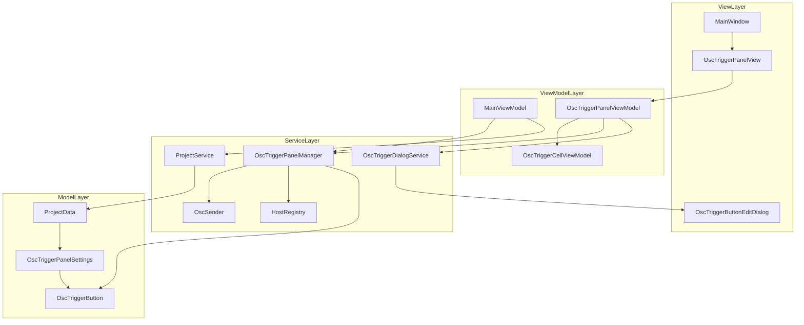
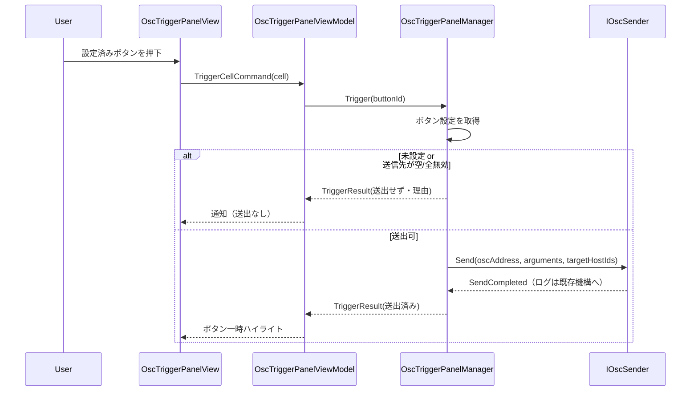

# Technical Design Document — osc-trigger-panel

## Overview

**Purpose**: 本機能は、タイムコードの進行に依存しない手動 OSC 送出（ポン出し）手段を TimecodeBridge のオペレーターに提供する。固定グリッド上のボタンを押すだけで、事前設定した OSC アドレス・引数を任意の送信先ホストへ即時送出できる。

**Users**: ライブ運用のオペレーターが、タイムコード再生中・停止中を問わず、任意タイミングで照明・映像・音響機器へ OSC コマンドを手動トリガーする用途で利用する。

**Impact**: 現状タブの無い `MainWindow` を `TabControl` 構成へ再編し、既存全機能を「タイムコード」タブに集約したうえで、新規「OSCポン出し」タブを追加する。OSC 送出（`IOscSender`）・ホスト管理（`HostRegistry`）・永続化（`ProjectData`）は既存資産を再利用し、新規送出/シリアライズ実装は行わない。

### Goals
- メイン画面をタブ化し、既存機能の操作性を維持したまま新タブを追加する。
- 行数×列数で構成する固定グリッド上に、設定可能なトリガーボタンを配置する。
- ボタン押下でタイムコード非依存の即時 OSC 送出を行い、結果をログに記録する。
- グリッド/ボタン設定をプロジェクト（既存 JSON）へ統合保存し、後方互換で読み込む。

### Non-Goals
- ボタンの自由配置（ドラッグ＆ドロップ、可変サイズ）。本仕様は固定グリッド（行×列）のみ。
- 新しい OSC 引数型（blob/bool/timetag 等）の追加。既存の int32/float32/string のみ。
- MIDI/キーボードショートカット等の外部トリガー連携。
- OSC 受信・双方向通信。送出（ポン出し）のみ。

## Architecture

### Existing Architecture Analysis
- **パターン**: MVVM（CommunityToolkit.Mvvm）+ DI（Microsoft.Extensions.DependencyInjection）。状態は Singleton サービスが保持し、ViewModel が参照、`MainViewModel` が Save/Open/New 時に集約・復元する。
- **保つべき境界**: OSC 送出は `IOscSender` に集約、送信先は `HostRegistry`、永続化は `ProjectData`/`ProjectService`。これらは変更せず利用する（`ProjectData` のみフィールド追加）。
- **統合点**: `MainWindow.xaml`（レイアウト）、`MainWindow.xaml.cs:OnDataContextChanged`（DI 配線）、`ServiceRegistration.cs`（DI 登録）、`MainViewModel`（永続化集約）。

### Architecture Pattern & Boundary Map



**Architecture Integration**:
- 選択パターン: 既存 `CueManager`（状態保持＋送出）+ `CueDialogService`（編集ダイアログ）+ ViewModel の三層構成を踏襲。
- 境界分離: グリッド/ボタンの真実の状態は `OscTriggerPanelManager`（Singleton）が保有。`OscTriggerPanelViewModel` は表示用射影。送出は `IOscSender` に委譲。
- 既存パターン維持: DI 登録、`OnDataContextChanged` 配線、`HostSelection` 流用、`ProjectData` 統合。
- 新規コンポーネント根拠: 状態保持と送出のために Manager、編集 UI のために Dialog、グリッド表示のために View/ViewModel が必要。

### Technology Stack

| Layer | Choice / Version | Role in Feature | Notes |
|-------|------------------|-----------------|-------|
| Frontend (WPF) | .NET 8 (net8.0-windows), WPF | タブ UI / 固定グリッド / 編集ダイアログ | 既存。`UniformGrid` でグリッド表示 |
| MVVM | CommunityToolkit.Mvvm 8.4.0 | `[ObservableProperty]`/`[RelayCommand]` | 既存パターン踏襲 |
| DI | Microsoft.Extensions.DependencyInjection 10.0.4 | Manager/DialogService/ViewModel 登録 | 既存 `ServiceRegistration` に追加 |
| OSC 送出 | BuildSoft.OscCore 1.2.1.1（`IOscSender` 経由） | ボタン送出 | 新規実装なし、既存口を利用 |
| Data / Storage | System.Text.Json（既存 `ProjectData`） | グリッド/ボタン設定の永続化 | camelCase + `OscArgumentJsonConverter` |

## System Flows

### ボタン押下による送出



> 未設定セルの主クリックは送出ではなく編集ダイアログを開く（R4.6）。送信先が空/全無効のときは送出せず通知する（R4.4）。送出結果のログは `IOscSender` 経由で既存ログ機構に乗る（R4.3）。

## Requirements Traceability

| Requirement | Summary | Components | Interfaces | Flows |
|-------------|---------|------------|------------|-------|
| 1.1, 1.4 | 起動時にタブ表示・タイムコード初期選択 | MainWindow | XAML TabControl | — |
| 1.2 | タイムコードタブに既存機能集約 | MainWindow | 既存 View 群 | — |
| 1.3 | タブ切替でも背景処理継続 | MainWindow | TabControl(View 非破棄) | — |
| 2.1, 2.2, 2.3 | 行列指定の固定グリッド/各セル最大1ボタン | OscTriggerPanelManager, OscTriggerPanelViewModel, OscTriggerPanelView | `IOscTriggerPanelManager` | — |
| 2.4 | 行列の最小値(1)維持 | OscTriggerPanelViewModel | 入力検証 | — |
| 2.5 | 縮小時の範囲外ボタン確認 | OscTriggerPanelViewModel, OscTriggerPanelManager | 確認ダイアログ | — |
| 3.1–3.7 | ボタン設定（ラベル/アドレス/引数/ホスト/検証） | OscTriggerButtonEditDialog, OscTriggerDialogService | `IOscTriggerDialogService` | — |
| 4.1, 4.2, 4.6 | 即時送出/状態非依存/未設定セル | OscTriggerPanelManager, OscTriggerPanelViewModel | `IOscTriggerPanelManager.Trigger` | 送出フロー |
| 4.3 | 送出結果のログ記録 | OscSender(既存) | `SendCompleted` | 送出フロー |
| 4.4 | 送信先空/全無効時は送出せず通知 | OscTriggerPanelManager | `TriggerResult` | 送出フロー |
| 4.5 | 送出の視覚フィードバック | OscTriggerCellViewModel, OscTriggerPanelView | バインド | 送出フロー |
| 5.1–5.4 | 設定の保存/復元/未保存フラグ | ProjectData, MainViewModel, OscTriggerPanelManager | `GetSettings`/`LoadSettings` | — |
| 5.5 | 旧ファイルは既定値で継続 | ProjectData, OscTriggerPanelManager | デシリアライズ既定値 | — |
| 6.1–6.4 | 既存資産・テーマ・MVVM 準拠 | 全コンポーネント | `IOscSender`/`HostRegistry`/DarkTheme | — |

## Components and Interfaces

| Component | Domain/Layer | Intent | Req Coverage | Key Dependencies (P0/P1) | Contracts |
|-----------|--------------|--------|--------------|--------------------------|-----------|
| OscTriggerPanelManager | Service | グリッド/ボタンの状態保持・送出・永続化入出力 | 2, 4, 5 | IOscSender (P0), IHostRegistry (P0) | Service, State |
| OscTriggerDialogService | Service | ボタン編集ダイアログの表示 | 3 | OscTriggerButtonEditDialog (P0) | Service |
| OscTriggerPanelViewModel | ViewModel | グリッド構成・セル射影・送出/編集コマンド | 2, 3, 4 | IOscTriggerPanelManager (P0), IOscTriggerDialogService (P0), IHostRegistry (P1) | State |
| OscTriggerCellViewModel | ViewModel | 1 セル分の表示状態 | 2, 4 | — | State |
| OscTriggerPanelView | View | 固定グリッド表示（UniformGrid） | 1, 2, 4 | OscTriggerPanelViewModel (P0) | — |
| OscTriggerButtonEditDialog | View | ラベル/アドレス/引数/ホスト編集 | 3 | HostSelection (P1) | — |
| OscArgumentText (helper) | Util | 引数の `i:/f:/s:` 記法のパース/整形 | 3 | — | Service |

### Service 層

#### OscTriggerPanelManager

| Field | Detail |
|-------|--------|
| Intent | 固定グリッドとボタン集合の真実の状態を保持し、送出と永続化入出力を担う |
| Requirements | 2.1, 2.2, 2.3, 4.1, 4.2, 4.3, 4.4, 5.1, 5.2, 5.5 |

**Responsibilities & Constraints**
- グリッドの `Rows`/`Columns` と `OscTriggerButton` 集合（位置 `Row`/`Column` 付き）を保持。
- セル単位の upsert / 取得 / 削除。1 セルにつき最大 1 ボタン（同一 `Row`/`Column` は単一）。
- `Trigger(buttonId)`: 対象ボタンの送信先有効性を判定し、可なら `IOscSender.Send` を呼ぶ。不可（未設定/空/全無効）なら送出せず理由を返す。
- 永続化用に `GetSettings()`/`LoadSettings()`/`Clear()` を提供。状態変更時に `Changed` を通知。

**Dependencies**
- Outbound: `IOscSender` — OSC 送出（P0）
- Outbound: `IHostRegistry` — 送信先ホストの有効性解決（P0）

**Contracts**: Service [x] / State [x]

##### Service Interface
```csharp
public interface IOscTriggerPanelManager
{
    int Rows { get; }
    int Columns { get; }
    IReadOnlyList<OscTriggerButton> Buttons { get; }

    void SetGridSize(int rows, int columns);          // 1未満は拒否（既定下限1）
    OscTriggerButton? GetButtonAt(int row, int column);
    IReadOnlyList<OscTriggerButton> GetOutOfRangeButtons(int rows, int columns); // 縮小プレビュー用
    void UpsertButton(OscTriggerButton button);        // Id一致で更新、無ければ追加
    void RemoveButton(string buttonId);

    TriggerResult Trigger(string buttonId);            // 送出（不可時は送出せず理由返却）

    OscTriggerPanelSettings GetSettings();             // 永続化（保存）
    void LoadSettings(OscTriggerPanelSettings settings); // 復元（読込）
    void Clear();                                       // 新規プロジェクト用に既定化

    event EventHandler? Changed;
}

public readonly record struct TriggerResult(bool Sent, TriggerSkipReason Reason);
public enum TriggerSkipReason { None, NotConfigured, NoEnabledTarget }
```
- Preconditions: `Trigger` は存在する `buttonId` を前提（不在は `NotConfigured` として送出せず返す）。
- Postconditions: `Sent==true` のとき `IOscSender.Send` を 1 回呼び出し済み。
- Invariants: 同一 `(Row, Column)` に複数ボタンは存在しない。`Rows>=1 && Columns>=1`。

**Implementation Notes**
- Integration: 送出は既存 `IOscSender.Send(address, args, targetHostIds)` をそのまま使用（ログは既存機構が `SendCompleted` を購読）。有効ホスト判定は `IHostRegistry.GetEnabledHosts(targetHostIds)` の結果が空かで決定。
- Validation: `SetGridSize` は 1 未満を拒否（R2.4）。`GetOutOfRangeButtons` で縮小時の影響を ViewModel に提示（R2.5）。
- Risks: `Changed` の発火粒度が荒いと再構築が頻発 → 構成変更系のみで発火する。

#### OscTriggerDialogService

| Field | Detail |
|-------|--------|
| Intent | ボタン編集ダイアログの生成・表示（既存 `CueDialogService` と同型） |
| Requirements | 3.1, 3.2, 3.3, 3.4, 3.5, 3.6 |

**Contracts**: Service [x]

##### Service Interface
```csharp
public interface IOscTriggerDialogService
{
    // template を編集して返す。キャンセル時は null。
    OscTriggerButton? ShowEditDialog(OscTriggerButton template, IReadOnlyList<OscHost> hosts, string title);
}
```
**Implementation Notes**
- Integration: `Application.Current.MainWindow` を `Owner` に設定（既存 `CueDialogService` と同様）。
- Validation: OSC アドレスは `/` 始まり必須・空不可（R3.6）。引数は `OscArgumentText` でパース。

### ViewModel 層

#### OscTriggerPanelViewModel

| Field | Detail |
|-------|--------|
| Intent | Manager の状態をセル配列へ射影し、送出/編集/グリッドサイズ変更を仲介 |
| Requirements | 2.1, 2.2, 2.4, 2.5, 3.1, 3.7, 4.1, 4.5, 4.6 |

**Contracts**: State [x]

**State Management**
- State model: `Rows`/`Columns`（`[ObservableProperty]`）、`ObservableCollection<OscTriggerCellViewModel> Cells`（`Rows*Columns` 個、行優先順）。
- Persistence: 状態の真実は Manager。VM は `SyncFromService()` で再構築。
- Commands:
  - `TriggerCellCommand(cell)`: 設定済み→`Manager.Trigger`、未設定→編集ダイアログ（R4.6）。
  - `EditCellCommand(cell)`: `IOscTriggerDialogService.ShowEditDialog` を開き、結果を `Manager.UpsertButton`。
  - `ClearCellCommand(cell)`: `Manager.RemoveButton`。
  - グリッドサイズ変更: `Rows`/`Columns` 変更時に 1 未満を補正（R2.4）。縮小で範囲外ボタンがあれば確認のうえ `Manager` から削除（R2.5）→`Cells` 再構築。
- Feedback: 送出時に対象 `OscTriggerCellViewModel.IsFlashing` を一時的に true にして UI ハイライト（R4.5）。

**Implementation Notes**
- Integration: `IHostRegistry.HostChanged` を購読し、編集ダイアログに渡すホスト一覧を最新化。
- Risks: `Cells` 全再構築はグリッドサイズ変更/ロード時のみ。単一ボタン更新は該当セルのみ更新する。

#### OscTriggerCellViewModel — Summary-only

- 1 セル分の表示状態（`Row`, `Column`, `IsConfigured`, `Label`, `IsFlashing`, 紐づく `OscTriggerButton?`）。新たな境界は持たず、`OscTriggerPanelViewModel` が生成・管理する。

### View 層（Summary-only）

- **OscTriggerPanelView**: ヘッダに行数/列数入力（数値）。本体は `ItemsControl`（`ItemsSource=Cells`）+ `ItemsPanel` を `UniformGrid`（`Rows`/`Columns` バインド）で固定グリッド表示。各セルは `Button`（`Command=TriggerCellCommand`、`CommandParameter=cell`）。設定済み/未設定でスタイル差。編集は右クリック `ContextMenu`（編集/クリア）または編集アイコン。`DarkTheme` リソース（Card/Accent/Border）を使用（R6.3）。
- **OscTriggerButtonEditDialog**: `CueEditDialog` を範として、ラベル・OSCアドレス・引数（`i:/f:/s:` テキスト）・ホスト選択（`HostSelection` チェックリスト）。OK 時に検証して `OscTriggerButton` を返す。

### Util 層

#### OscArgumentText — Summary-only

- `CueEditDialog` の `ParseArguments`/`FormatArguments` と同一記法（`i:int`, `f:float`, `s:string`、空白区切り）を提供する静的ヘルパ。CueEditDialog と新ダイアログで共用し挙動を統一（重複排除）。

```csharp
public static class OscArgumentText
{
    public static string Format(IReadOnlyList<OscArgument> args);
    public static List<OscArgument> Parse(string text);
}
```

## Data Models

### Domain Model
- `OscTriggerButton`（エンティティ）: グリッド上の 1 ボタン。`Id` で一意。位置 `Row`/`Column`。
- `OscTriggerPanelSettings`（集約ルート）: グリッド寸法 `Rows`/`Columns` とボタン集合。永続化単位。
- 不変条件: `Rows>=1`, `Columns>=1`、同一 `(Row, Column)` に 1 ボタンのみ、`0<=Row<Rows`, `0<=Column<Columns`。

### Logical Data Model
```csharp
namespace TimecodeBridge.Models;

public class OscTriggerButton
{
    public required string Id { get; set; }       // Guid 文字列
    public int Row { get; set; }                  // 0-based
    public int Column { get; set; }               // 0-based
    public string Label { get; set; } = string.Empty;
    public string OscAddress { get; set; } = string.Empty;
    public List<OscArgument> Arguments { get; set; } = [];
    public List<string> TargetHostIds { get; set; } = [];
}

public class OscTriggerPanelSettings
{
    public int Rows { get; set; } = 4;            // 既定 4x4
    public int Columns { get; set; } = 4;
    public List<OscTriggerButton> Buttons { get; set; } = [];
}
```

### Data Contracts & Integration
- `ProjectData` に `public OscTriggerPanelSettings OscTriggerPanel { get; set; } = new();` を追加。
- シリアライズは既存 `ProjectData.CreateJsonOptions()`（camelCase + `OscArgumentJsonConverter`）で `Arguments` も自動対応。新規コンバータ不要。
- 後方互換: 旧ファイルに `oscTriggerPanel` が無い場合、`System.Text.Json` は既定インスタンス（空 + 4x4）を割り当て、読み込みを継続（R5.5）。
- `MainViewModel` 統合点（4 箇所）:
  - `SaveToPath`: `OscTriggerPanel = _oscTriggerPanelManager.GetSettings()`。
  - `OpenProject`: `_oscTriggerPanelManager.LoadSettings(data.OscTriggerPanel)` → `_oscTriggerPanelViewModel.SyncFromService()`。
  - `NewProject`/`ClearAllData`: `_oscTriggerPanelManager.Clear()` → `SyncFromService()`。

## Error Handling

### Error Strategy
入力は境界（編集ダイアログ・グリッドサイズ入力）で早期検証し、送出は前提不成立時に安全に no-op として通知する。

### Error Categories and Responses
- **User Errors（入力）**:
  - OSC アドレス未入力/`/` 始まりでない → ダイアログ保存を拒否し警告（R3.6、`CueEditDialog` と同一メッセージ方針）。
  - 引数記法不正トークン → 当該トークンを無視（`CueEditDialog` と同挙動）。
  - 行列に 1 未満 → 1 に補正（R2.4）。
- **Business Logic Errors（送出前提）**:
  - 未設定セル押下 → 送出せず編集ダイアログを開く（R4.6, `TriggerSkipReason.NotConfigured`）。
  - 送信先が空/全無効 → 送出せず通知（R4.4, `NoEnabledTarget`）。
  - グリッド縮小で範囲外ボタン → 確認ダイアログ後に該当ボタン削除（R2.5）。
- **System Errors（送出時）**: `IOscSender` 内で例外捕捉済み（`SendToHost` が try/catch し `SendCompleted` で失敗通知）。本機能は追加のネットワーク例外処理を持たず既存機構に委譲（R4.3）。

### Monitoring
- 送出結果（成功/失敗・宛先・アドレス）は既存ログ機構（`OscSender.SendCompleted` 購読）に記録される（R4.3）。本機能で追加のログ配線は行わない。

## Testing Strategy

### Unit Tests
- `OscTriggerPanelManager.Trigger`: 設定済み→`IOscSender.Send` 呼出（モック検証）/ 未設定→`NotConfigured` no-op / 送信先全無効→`NoEnabledTarget` no-op。
- `OscTriggerPanelManager.SetGridSize`: 1 未満拒否、`GetOutOfRangeButtons` が縮小時の範囲外ボタンを正しく列挙。
- `OscTriggerPanelManager` の `UpsertButton`/`RemoveButton`/`GetButtonAt`: 同一 `(Row,Column)` 単一性の保証。
- `OscArgumentText.Parse`/`Format`: int/float/string 複数のラウンドトリップ、不正トークン無視。

### Integration Tests
- 永続化ラウンドトリップ: `OscTriggerPanelSettings` を含む `ProjectData` を Save→Load し、グリッド寸法・ボタン（引数含む）が一致。
- 後方互換: `oscTriggerPanel` 欠落 JSON の読込が既定値で成功。
- `MainViewModel` の New/Open/Save がパネル状態を正しく集約・復元・初期化。

### E2E/UI Tests（手動確認）
- タブ切替で既存機能が従来どおり動作し、背景処理が継続する（R1.3）。
- ボタン押下で送出され、対象ボタンがハイライトし、ログに記録される。

## Security Considerations
- 本機能は LAN 内 OSC（UDP）送出のみで、認証・機微情報は扱わない。送信先は既存 `HostRegistry` 管理下のホストに限定され、新たな攻撃面は増えない。ベースラインは既存運用に準拠。
